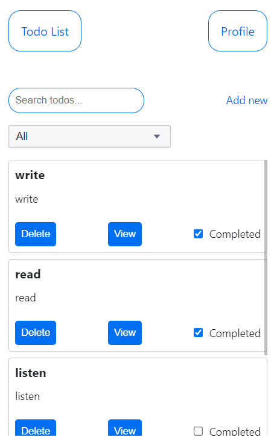
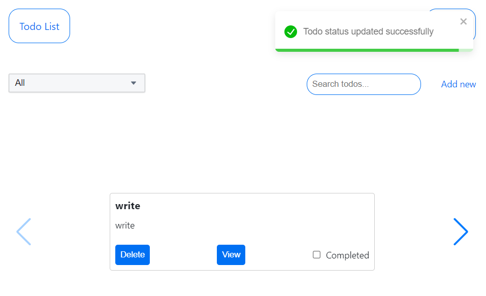
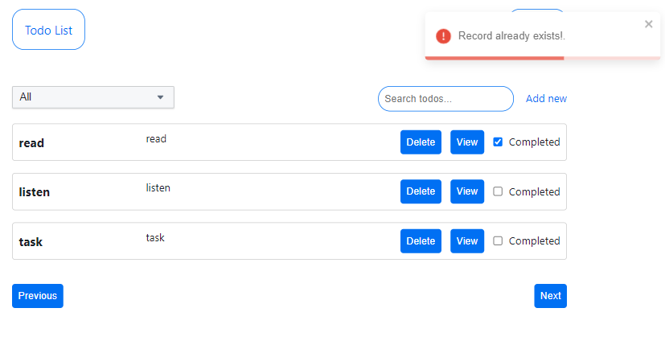

# Todos APP 

## Project Description
Web application designed for managing Todo lists with user registration and authentication capabilities. The application is built using modern frontend and backend technologies, ensuring fast and stable performance, as well as a responsive interface across different devices.

## Project Functionality
1. Todo List:
   - Backend CRUD Operations: The project includes full CRUD operations (Create, Read, Update, Delete) for managing tasks on the backend. This is implemented using an Express server with TypeScript, which interacts with a PostgreSQL database through Prisma ORM.
   - Integration of CRUD Operations with Frontend: All server-side task operations are synchronized with the frontend, built with React and TypeScript, ensuring dynamic user interaction with the application.
   - Responsive Design:
      - Desktop: Tasks are displayed in a table format.
      - Tablet: Tasks are displayed in a slider format.
      - Mobile: Tasks are displayed in a list format.
2. Authentication and Registration:
   - Backend: The project includes an authentication system with user registration functionality. Users have fields for entering a username, password, and email.
   - Account Verification: After registration, users must verify their account via email, facilitated by integration with the SendGrid service.
   - Password Management: The application supports password changes and password recovery through a special link sent via email.
   - Frontend: The application provides a user interface for login and registration, along with the ability to log out and edit user information (username and password).
3. Task Filtering:
   - Users can filter tasks by title and status (private or completed). Filter parameters are passed through req.params in server requests and are synchronized with UI components.
4. Pagination:
   - Server-Side Pagination: All pagination operations are handled on the server, with the frontend receiving data based on pagination parameters.
   - Responsive Pagination:
      - Desktop: Pagination is implemented through buttons.
      - Tablet: Pagination is handled via horizontal scroll.
      - Mobile: Pagination is handled via vertical scroll. 

## Technologies:
  - Backend: Express, TypeScript, PostgreSQL, Prisma ORM, Passport for authentication.
  - Frontend: React, TypeScript, Zustand for state management, Formik for form handling, Emotion CSS for component styling.
   
## Installation and Setup
  - clone the repository: https://github.com/IvanRuskevych/todos-app
### Backend:
  - `cd server` - navigate to the backend folder
  - `yarn` - install dependencies
  - `yarn serve` - start the backend
  - open your browser and navigate to http://localhost:3030
### Frontend:
  - `cd client` - navigate to the frontend folder
  - `yarn` - install dependencies
  - `yarn dev` - start the frontend
  - Open your browser and navigate to http://localhost:5174

